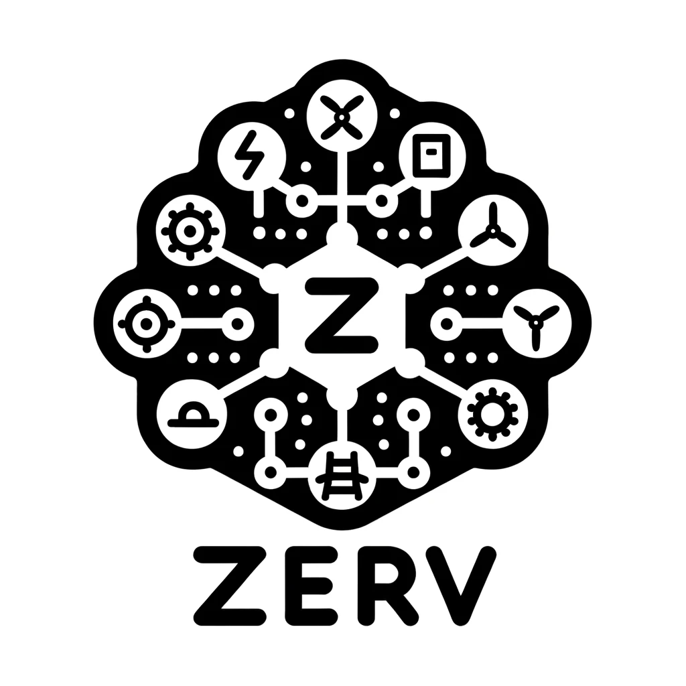

## Overview

Zerv is an innovative framework built on the Zephyr RTOS, designed to streamline the development of embedded systems through a service-oriented architecture. This framework introduces the concept of 'Zervices', specialized wrappers around Zephyr RTOS threads. Zerv emphasizes modularity, efficiency, and communication flexibility, adhering to a Unix-inspired architecture pattern.

## Features

Zerv provides an environment for creating and managing Zervices, which are capable of intercommunication using three distinct patterns:

### 1. Request-Response Pattern

- **Functionality:** Enables a thread or Zervice to request services by passing parameters through a Zerv command.
- **Command Structure:** Each command details a behavior that the Zervice implements, allowing for multiple commands per Zervice. This is an optimization over the traditional Unix philosophy, enhancing cohesion and efficiency.
- **Synchronous Execution:** Requests are performed synchronously, blocking the requesting thread or Zervice until the command handler in the requested Zervice completes the operation.

### 2. Message Passing

- **Asynchronous Communication:** Threads or Zervices can pass messages to another Zervice asynchronously.
- **Priority Management:** The execution of the passer may be blocked depending on the priority levels of the sender and receiver.
- **Message Types:** Zervices can declare multiple message types that they can handle, with each type being defined by the receiving Zervice.

### 3. Publish-Subscribe (Pub-Sub) Pattern

- **Topic Subscriptions:** Zervices can subscribe to topics defined by other Zervices, enabling a flexible and dynamic data distribution mechanism.

## Getting Started

To begin using Zerv:

1. **Prerequisites:** Ensure you have Zephyr RTOS installed and configured on your system.
2. **Installation:** Clone the Zerv repository and follow the setup instructions in the installation guide.
3. **Documentation:** Refer to the detailed documentation for guidance on creating and managing Zervices, as well as utilizing the communication patterns effectively.

## Contributing

We welcome contributions to the Zerv project. If you're interested in contributing, please read our contributing guidelines and submit your pull requests.

## License

Zerv is released under [Apache 2.0 License](LICENSE), which provides details on the usage and redistribution terms.

## Support

For support, questions, or more information, please visit our [issues page](https://github.com/Systemfabriken/zerv/issues) or contact us at [albin@systemfabriken.tech](albin@systemfabriken.tech).

## Acknowledgments

Zerv is built upon the robust foundation of Zephyr RTOS, and we extend our gratitude to the Zephyr community for their invaluable support and resources.

---

*This README is subject to updates and modifications to reflect the ongoing development and improvement of the Zerv framework.*
